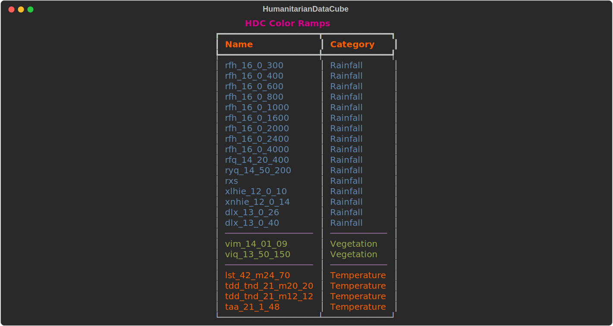
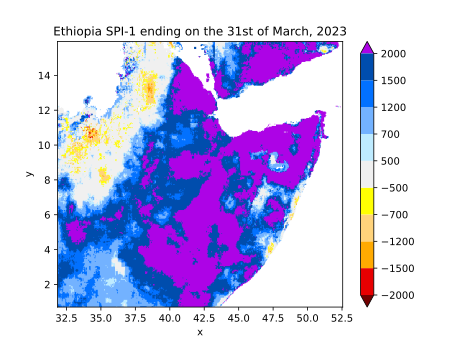

# hdc-colors

This repository contains the color-ramp sources for all* data from the HumanitarianDataCube (HDC), along with some thin python code for user / system interface.

### Installation

```
# mamba/conda
mamba install -c https://data.earthobservation.vam.wfp.org/hdc/ hdc-colors

# pip
pip install --extra-index-url=https://data.earthobservation.vam.wfp.org/pypi/ hdc-colors

```
> **Note**
> 
>The main purpose of this repo is to contain the color source, keeping the dependencies minimal. To install all dependencies that might be required for users, please use extras install `hdc-colors[all]`.

### Available color ramps

<div style="width: 100%;">
  
</div>

### Usage example

```python
import rioxarray
from hdc.colors.rainfall import rxs

# load raster and drop time dim
x = rioxarray.open_rasterio(
    "https://data.earthobservation.vam.wfp.org/docs-data/spi/ethr1s202303d3.tif",
    mask_and_scale=True,
).squeeze()


# need to set min/max and levels but exclude last one (which is inf)
x.plot.imshow(cmap=rxs.cmap, vmin=-2000, vmax=2000, levels=rxs.vals[:-1], extend="both")

# set title
plt.title("Ethiopia SPI-1 ending on the 31st of March, 2023")


```
<div style="width: 100%;">
  
</div>